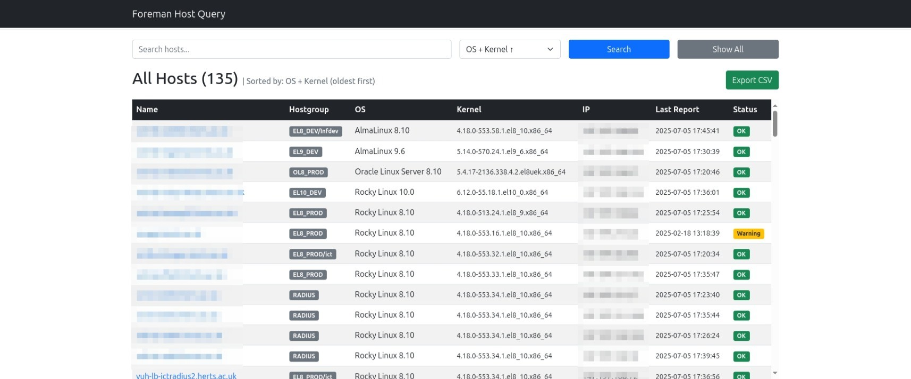
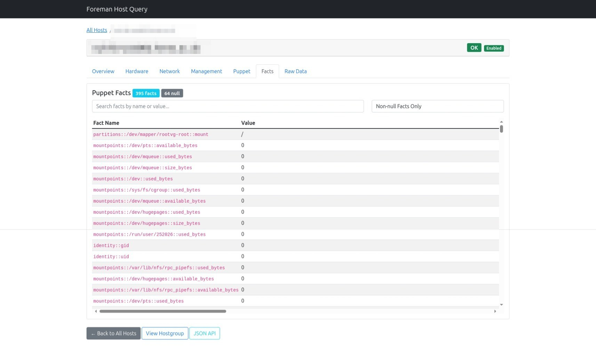

# Foreman Host Query Application

A Flask web application and command-line tool for querying and displaying Foreman host information in a user-friendly format.

## Screenshots

### Main Dashboard
The dashboard provides a comprehensive view of all hosts with intelligent sorting and filtering capabilities:



**Key Features Shown:**
- 135 hosts displayed with OS + Kernel sorting (oldest first)
- Search functionality with dropdown filters
- Export CSV capability
- Color-coded status indicators (OK, Warning)
- Sortable columns: Name, Hostgroup, OS, Kernel, IP, Last Report, Status

### Facts Tab - Comprehensive System Information
Access detailed Puppet facts for in-depth system analysis:



**Key Features Shown:**
- 355 facts with real values, 64 null facts displayed
- Real-time search across fact names and values
- Category filtering (Non-null Facts Only shown)
- Complete filesystem, hardware, and system information
- Scrollable interface for hundreds of facts

## Overview

This application provides both a web interface and command-line tool to query Foreman hosts, displaying key information like hostname, hostgroup, operating system, kernel version, IP address, last report time, and status. **The standout feature is complete access to all Puppet facts data** - previously inaccessible through standard Foreman interfaces.

## Features

### Web Interface
- **Dashboard view** - Display all hosts in a responsive table with intelligent OS+Kernel sorting
- **Search functionality** - Search hosts by name with real-time filtering
- **Hostgroup filtering** - Click hostgroup badges to filter hosts  
- **Individual host details** - Comprehensive tabbed view for each host (Overview, Hardware, Network, Management, Puppet, **Facts**, Raw Data)
- **Complete Facts Access** - View all 400+ Puppet facts with search and category filtering
- **CSV export** - Export filtered results to CSV format
- **REST API endpoints** - Programmatic access to host data
- **Status indicators** - Color-coded status badges (OK/Warning/Error)
- **Responsive design** - Works on desktop and mobile devices

### Facts Tab - The Standout Feature
- **Complete Puppet Facts Access** - Browse all 400+ facts collected by facter
- **Smart Categorization** - Filter by System, Hardware, Network, OS, Disks, Memory, SSH Keys
- **Real-time Search** - Search across fact names and values instantly  
- **Non-null Filtering** - Focus on facts with actual values (default view)
- **Comprehensive Data** - CPU details, memory info, disk partitions, network interfaces, SSH keys, software versions, and much more
- **Previously Inaccessible** - Data that was collected but not viewable through standard Foreman web interface

### Command Line Tool
- **Multiple output formats** - JSON or CSV output
- **Flexible querying** - Search, filter by hostgroup/environment
- **Individual host lookup** - Get detailed information for specific hosts

## Why This Application?

### Problem Solved
Standard Foreman web interface provides basic host information, but **Puppet collects 400+ detailed facts** about each system that are largely inaccessible. System administrators need this data for:
- **Security auditing** - Find systems with old kernels or vulnerable software
- **Capacity planning** - Analyze memory, CPU, and disk usage patterns
- **Troubleshooting** - Access detailed hardware and network configuration
- **Compliance** - Verify system configurations and installed software

### Solution Provided
This application **unlocks the complete Puppet facts database** through an intuitive web interface, providing unprecedented visibility into your infrastructure with features like:
- **Intelligent sorting** (OS + Kernel oldest first) to quickly identify problem systems
- **Comprehensive search** across all system data
- **Export capabilities** for reporting and analysis

### Technical Achievement
This application **solved a major limitation** in Foreman deployments by discovering the correct API endpoint (`/api/fact_values`) to access the complete Puppet facts database. Through systematic API exploration and testing, we unlocked access to data that was being collected but not exposed through standard interfaces.

## Installation

### Prerequisites
- Python 3.7+
- Access to Foreman API

### Setup
```bash
cd ForemanQuery

# Create virtual environment
python3 -m venv venv

# Activate virtual environment
. ./venv/bin/activate

# Install dependencies
pip install -r requirements.txt

# Configure credentials
cp .env.example .env
# Edit .env and add your Foreman credentials
```

**Note**: Always activate the virtual environment before running the application:
```bash
. ./venv/bin/activate
```

### Configuration

Create a `.env` file with your Foreman credentials:
```bash
cp .env.example .env
```

Edit the `.env` file:
```
FOREMAN_URL=https://your-foreman-server.example.com
FOREMAN_USERNAME=your_username
FOREMAN_PASSWORD=your_password
```

**Important**: 
- The `.env` file is excluded from git to protect your credentials.
- All three environment variables (FOREMAN_URL, FOREMAN_USERNAME, FOREMAN_PASSWORD) are required.
- Replace `your-foreman-server.example.com` with your actual Foreman server URL.

## Git Repository Setup

To initialize this as a git repository:

```bash
# Initialize git safely (excludes credentials)
./init-git.sh

# Add remote repository
git remote add origin <your-repo-url>

# Push to remote
git push -u origin main
```

The init script automatically excludes credentials and creates a proper initial commit.

## Usage

### Web Application

#### Development Server (Flask)
```bash
# Make sure virtual environment is activated
. ./venv/bin/activate

# Run development server
./run.sh
```
Access the web interface at: `http://localhost:8087`

#### Production Server (Gunicorn)
```bash
# Make sure virtual environment is activated
. ./venv/bin/activate

# Run production server
./gunicorn.sh
```

#### Systemd Service (Rocky Linux 9)
For production deployment as a system service:

```bash
# Install the systemd service
sudo ./install-service.sh

# Start the service
sudo systemctl start foreman-query

# Check status
sudo systemctl status foreman-query

# View logs
sudo journalctl -u foreman-query -f

# Stop the service
sudo systemctl stop foreman-query
```

The service will automatically start on boot and restart if it crashes.

### Command Line Tool
A command-line tool is included for direct API queries:

**First, set up your credentials:**
```bash
export FOREMAN_USERNAME=your_username
export FOREMAN_PASSWORD=your_password
# Optional: export FOREMAN_URL=https://your-foreman-server
```

**Then use the tool:**
```bash
# Show all hosts in JSON format
python3 foreman_query.py -a

# Show all hosts in CSV format
python3 foreman_query.py -a --csv

# Search for specific hosts
python3 foreman_query.py -s rocky10 --csv

# Get specific host details
python3 foreman_query.py -n hostname.example.com

# Filter by hostgroup
python3 foreman_query.py -g EL10_DEV --csv

# Filter by environment
python3 foreman_query.py -e uhcommon
```

**Note**: The command-line tool requires the same environment variables as the web application. You can also pass credentials via command line arguments if needed.

## Web Interface Navigation

### Main Dashboard
- **Search Bar** - Enter hostname or partial name to filter results
- **Host Table** - Click hostname to view detailed information
- **Hostgroup Badges** - Click to filter hosts by hostgroup
- **Export CSV** - Download current view as CSV file
- **Show All** - Reset filters and show all hosts

### Host Detail Page
- **Comprehensive Information** - Name, hostgroup, OS, kernel, IP, status
- **Navigation** - Breadcrumb navigation and quick links
- **Related Actions** - View all hosts in same hostgroup

### CSV Export
- **Filtered Export** - Export respects current search/filter
- **All Fields** - Includes all displayed columns
- **Standard Format** - Compatible with spreadsheet applications

## API Endpoints

The application provides REST API endpoints for programmatic access:

### Get All Hosts
```
GET /api/hosts
```
Returns JSON array of all hosts.

### Search Hosts
```
GET /api/search?q=search_term
```
Returns JSON array of hosts matching search term.

### Export CSV
```
GET /export/csv
GET /export/csv?q=search_term
GET /export/csv?hostgroup=EL10_DEV
```
Returns CSV file with host data.

## Configuration

### Foreman API Settings
Configure the application using environment variables in the `.env` file:
- **FOREMAN_URL**: Foreman server URL (required)
- **FOREMAN_USERNAME**: Your Foreman username (required)
- **FOREMAN_PASSWORD**: Your Foreman password (required)

You can also set these as system environment variables instead of using the `.env` file.

### Server Configuration

#### Development Settings
- **Host**: `0.0.0.0` (accessible from network)
- **Port**: `8087`
- **Debug Mode**: Enabled

#### Production Settings (Gunicorn)
- **Workers**: 4
- **Timeout**: 120 seconds
- **Bind**: `0.0.0.0:8087`

## Data Fields

The application displays the following information for each host:

| Field | Description |
|-------|-------------|
| **Name** | Fully qualified hostname |
| **Hostgroup** | Foreman hostgroup assignment |
| **OS** | Operating system name and version |
| **Kernel** | Current kernel version |
| **IP** | Primary IP address |
| **Last Report** | Timestamp of last Puppet report |
| **Status** | Overall host status (OK/Warning/Error) |

## File Structure

```
ForemanQuery/
├── app.py              # Main Flask application
├── foreman_query.py    # Command-line tool for direct API queries
├── requirements.txt    # Python dependencies
├── run.sh             # Development server script
├── gunicorn.sh        # Production server script
├── gunicorn.conf.py   # Gunicorn configuration with SSL and logging
├── foreman-query.service # Systemd service file
├── install-service.sh  # Service installation script
├── init-git.sh        # Git repository initialization script
├── .env.example       # Environment variables template
├── README.md          # This documentation
├── .gitignore         # Git ignore file
├── venv/              # Virtual environment (created after setup)
├── .env               # Your credentials (created after setup, not in git)
└── templates/
    ├── base.html      # Base template with navigation
    ├── index.html     # Main dashboard template
    └── host_detail.html # Individual host details template
```

## Troubleshooting

### Common Issues

#### Credential Issues
If you get authentication errors:
1. Check that `.env` file exists and contains valid credentials
2. Verify environment variables: `echo $FOREMAN_USERNAME`
3. Test credentials manually: `curl -u username:password https://foreman-server/api/hosts`

#### Virtual Environment Issues
If you encounter import errors or package not found errors:
1. Ensure virtual environment is activated: `. ./venv/bin/activate`
2. Verify packages are installed: `pip list`
3. Reinstall if necessary: `pip install -r requirements.txt`

#### SSL Certificate Warnings
The application disables SSL verification for the Foreman API. This is normal for internal infrastructure.

#### Connection Timeouts
If experiencing timeouts:
1. Verify network connectivity to Foreman server
2. Check if credentials are correct
3. Increase timeout in gunicorn configuration

#### Port Already in Use
If port 8087 is busy:
1. Change port in `run.sh` or `gunicorn.sh`
2. Update firewall rules if necessary

### Debug Mode
Development server runs with debug mode enabled, providing detailed error messages in the browser.

## Security Considerations

- **Internal Use Only** - Application contains hardcoded credentials
- **Network Access** - Runs on all interfaces (0.0.0.0) for network accessibility
- **SSL Verification** - Disabled for internal Foreman API access
- **Authentication** - No built-in authentication (add reverse proxy if needed)

## Future Enhancements

Potential improvements for future versions:
- User authentication and authorization
- Real-time updates via WebSocket  
- ✅ ~~Advanced filtering and sorting options~~ **COMPLETED**
- ✅ ~~Complete Puppet facts access~~ **COMPLETED**
- Host performance metrics and trending
- Configuration management integration
- Custom dashboards and reports
- Facts comparison between hosts
- Historical facts tracking
- Automated security scanning based on facts data